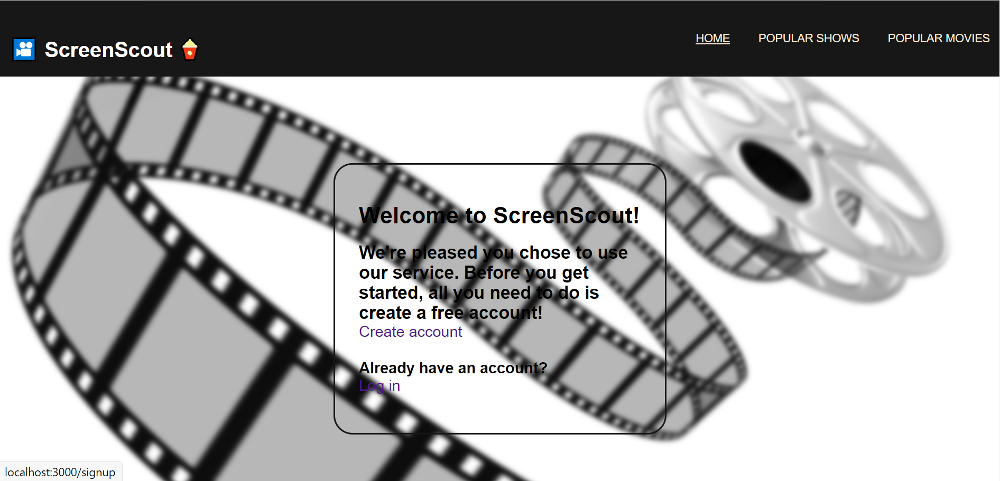

### ScreenScout - a reactJS frontend application

###### Introduction

Hi there! 

Glad to have you here. ScreenScout is a web application that consumes a third party API (www.themoviedb.org).
It's where you go to have a look for ideas when you're bored and asking yourself 'what should I watch tonight?'.
In order to make use of the services you need to register an account, and log in. User accounts are registered on a Heroku server.

###### Requirements

As mentioned, ScreenScout consumes a third party API. This API requires an API key. You can request one after registering.

Simply visit www.themoviedb.org/signup and register. 

Then go to your account settings page and click the 'API' link in the left hand side bar.

Now enter your details to request a key.

###### How to run ScreenScout?

1. In the main project directory create a new file titled '.env'

2. In the '.env' file add the following: 'REACT_APP_API_KEY=' followed by your API key. You should see the following: 
   
    **'REACT_APP_API_KEY=_yourAPIkeyhere_'**

3. Install all required modules by entering the following command in your IDE terminal:
   
    **npm install**

4. Once that is complete enter the follow in the IDE terminal to launch ScreenScout:
   
   **npm run start**
  
 
5. In your browser enter the following url 'http://localhost:3000/' and you will land on the homepage where you will find a link to 'Create an account'

Enjoy!